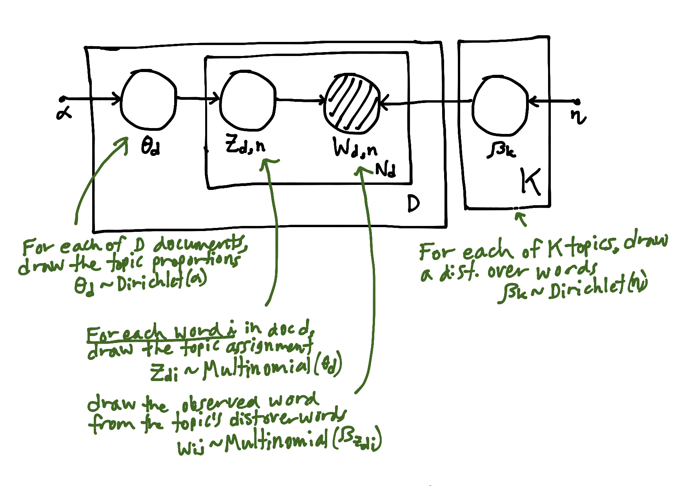

# NLP Strategy Overview
Predicting returns from 8K documents using text analysis and natural language processing.

## Results
We try a few models/combinations:
1. input variables: sentiment score (Quandl) vs. sentiment + 8K text
2. document-term matrix: CountVectorizer (bag-of-words) vs. Tf-idf
3. dimensionality reduction: PCA vs. LDA
4. Classifier: logistic regression vs. random forests

rem_col|vect|dim_red|clf|split0_test_score
---|---|---|---|---
drop_column|CountVectorizer|LatentDirichletAllocation|RandomForestClassifier|0.383
||||SGDClassifier|0.416
|||TruncatedSVD|RandomForestClassifier|0.383
||||SGDClassifier|0.408
||TfidfVectorizer|LatentDirichletAllocation|RandomForestClassifier|0.383
||||SGDClassifier|0.411
|||TruncatedSVD|RandomForestClassifier|0.383
||||SGDClassifier|0.41
use_text_col|CountVectorizer|LatentDirichletAllocation|RandomForestClassifier|0.412
||||SGDClassifier|0.418
|||TruncatedSVD|RandomForestClassifier|0.424
||||SGDClassifier|0.479
||TfidfVectorizer|LatentDirichletAllocation|RandomForestClassifier|0.42
||||SGDClassifier|0.438
|||TruncatedSVD|RandomForestClassifier|0.429
||||SGDClassifier|0.47

Let's show the most interesting part first, the results. These are run on raw
returns (not alphas), using 

| dimensionality redudction    | classifier             | f1_weighted |
| ---------------------------- | ---------------------- | ----------- |
| LatentDirichletAllocation    | RandomForestClassifier | 0.337532    |
|                              | SGDClassifier          | 0.404128    |
| TruncatedSVD                 | RandomForestClassifier | 0.333562    |
|                              | SGDClassifier          | 0.405563    |

## Setup
This setup assumes you already have `conda` and `git` installed.
1. Clone this repo at your terminal: `git clone https://github.com/hatemr/NLP-for-8K-documents.git`
2. Create the conda environment: `conda env create -f environment.yml`
3. Activate the environment: `conda activate ey-nlp`

## Data Preparation
1. Download 8K documents from today's S&P 500 companies for the past 5 years.
2. Extract the useful text from the html documents.
3. Clean text: 
    * From `/ey-nlp` run `python ey_nlp/preprocessing.py`. This creates a copy.
    * remove proper nouns (Apple), make lower case (The -> the), expand contractions (can't -> cannot), remove special characters and digits ('[^a-zA-z0-9\s]'), remove stopwords (a, the), remove html tags (`

`), remove accented characters, remove newlines ([\r|\n|\r\n]+), remove extra whitespace
4. Tokenize text:
    * lemmatize, stemmer
5. Vectorize to a document-term matrix using `CountVectorizer`.
    * All our models require creating the document-term matrix. However, we 
  might later try models that use another vectorizer (e.g. tf-idf).

## Target Variable
Our target variable is each companies' daily alpha, computed using the market
return. The market correlation, beta, is computed using the prior XXX weeks 
returns of the company. The alphas are discretized to obtain a multiclass 
classification problem: less than -0.01 is 0, -0.01 to 0.01 is 1, and greater
than 0.01 is 2. 

We also tried this approach applied to raw returns, instead of alpha. However,
we switched to alpha so our strategy would be independent of the overall market
performance.

We also tried using a binary classification where we split returns at 0, but we
decided that predicting _large_ movements was more likely to give a profitable
strategy.

## Data Splitting
  
| dataset       | dates             | n_samples     | indices     |
| ------------- | ----------------- | ------------- | ----------- |
| train         | 1/2/15 - 7/31/17  | 9947 (52%)    | 0:9947      |
| validate      | 7/31/17 - 8/31/18 | 4852 (25%)    | 9947:14799  |
| test          | 9/1/18 - 10/25/19 | 4284 (23%)    | 14799:19083 |
| total         | 1/2/15 - 10/25/19 | 19083 (100%)  | 0:19083     |
  
## Modeling
Our strategy varies along a few dimensions.

1. __Document-term matrix__: CountVectorizer, tf-idf
2. __Dimensionality reduction__: PCA, LDA, HLDA, SESTM [(Ke et. al. 2019)](references/Predicting_Returns_with_Text_Data.pdf)
3. __Horizon__: 1, 2, 3, 5, 10, 20, 30
4. __Model__: logistic regression, random forests, gradient boosting

## Scoring metric: f1_weighted
We use the scoring metric `f1_weighted` from `sklearn` on the validation set for 
model selection. I chose this metric because it seemed the simplest and most
common metric available in sklearn for the multiclass setting. `f1_weighted` computes
the f1 score for each class of the target variable, then takes the weighted 
mean over classes. The weight is the number of true instances of the class. This
helps account for class imbalance by giving greater weight to higher-frequency
classes.

One idea is to change the scoring metric to our own PnL calculation. However,
we seek to compare different NLP techniques with each other, not create a 
realistic investment stategy. Therefore, we stick with _f1_weighted_.

### LDA for Topic Modeling
Latent Dirichlet Allocation (LDA) aims to model documents as arising from multiple topics, where a _topic_ is defined to be a distribution over a fixed vocabulary of terms. Each document exhibits these topics with different proportions. The K topics and their relative weights are treated as hidden variables. Given a collection of documents, the _posterior distribution_ of the hidden variables given the observed documents determines a hidden topical decomposition of the collection.

## LDA Topic Explanation
* __Topic 1__: structuring change in the company’s management level: appointment of new CEO/ change in the committee
* __Topic 2__: new financial statement: assessment about tax/new acquisition
* __Topic 3__: recent press release about operations and financial statement
* __Topic 4__: expectations about earnings in the upcoming quarters
* __Topic 5__: recent earnings of the company and acquisition/ collaboration agenda.
* __Topic 6__: board of director member change
* __Topic 7__: vote for shareholders and appointment of public audit company
* __Topic 8__: amendment of agreement(all different agreement)
* __Topic 9__: realease Results of Operations and Financial Condition
* __Topic 10__: regulation FD disclosure and struction change of orginization

We classified all documents into different topics based on its highest probability across all topics. And by the similarity of its different text informatio, we extracted and summarized above as the explanation for each topic. 
(All topics are sentimental-neutral)

* LDA in sklearn: [here](https://scikit-learn.org/stable/modules/decomposition.html#latent-dirichlet-allocation-lda)

### Resources
* [Topic Models (Blei and Lafferty)](http://citeseerx.ist.psu.edu/viewdoc/download?doi=10.1.1.186.4283&rep=rep1&type=pdf)
* [Hierarchical Dirichlet Processes (gensim)](https://www.stat.berkeley.edu/~aldous/206-Exch/Papers/hierarchical_dirichlet.pdf)
