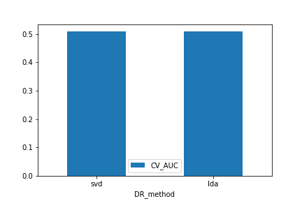

# NLP Strategy Overview
Predicting returns from 8K documents using text analysis and natural language processing.

## Results
Let's show the most interesting part first. This plot compares cross-validation AUC for two methods of dimensionality reduction: the SVD (PCA) and LDA. The two are close, and both very close to random guessing (0.5).

## Setup
This setup assumes you already have `conda` and `git` installed.
1. Clone this repo at your terminal: `git clone https://github.com/hatemr/NLP-for-8K-documents.git`
2. Create the conda environment: `conda env create -f environment.yml`
3. Activate the environment: `conda activate ey-nlp`

## Data Preparation
1. Download 8K documents from today's S&P 500 companies for the past 5 years.
2. Extract the useful text from the html documents.
3. Clean text: 
    * From `/ey-nlp` run `python ey_nlp/preprocessing.py`. This creates a copy.
    * remove proper nouns (Apple), make lower case (The -> the), expand contractions (can't -> cannot), remove special characters and digits ('[^a-zA-z0-9\s]'), remove stopwords (a, the), remove html tags (`

`), remove accented characters, remove newlines ([\r|\n|\r\n]+), remove extra whitespace
4. Tokenize text:
    * lemmatize, stemmer
5. Vectorize to a document-term matrix using `CountVectorizer`.
    * All our models require creating the document-term matrix. However, we 
  might later try models that use another vectorizer (e.g. tf-idf).

Train/test split on September 1, 2018:
  
| dataset       | n_samples     |
| ------------- | ------------- |
| train         | 14799         |
| test          | 4284          |
  
## Modeling
Our strategy varies along a few dimensions.

1. __Document-term matrix__: CountVectorizer, tf-idf
2. __Dimensionality reduction__: PCA, LDA, HLDA, SESTM [(Ke et. al. 2019)](references/Predicting_Returns_with_Text_Data.pdf)
3. __Horizon__: 1, 2, 3, 5, 10, 20, 30
4. __Model__: logistic regression, random forests, gradient boosting

### LDA for Topic Modeling
Latent Dirichlet Allocation (LDA) aims to model documents as arising from multiple topics, where a _topic_ is defined to be a distribution over a fixed vocabulary of terms. Each document exhibits these topics with different proportions. The K topics and their relative weights are treated as hidden variables. Given a collection of documents, the _posterior distribution_ of the hidden variables given the observed documents determines a hidden topical decomposition of the collection.

* LDA in sklearn: [here](https://scikit-learn.org/stable/modules/decomposition.html#latent-dirichlet-allocation-lda)

### Resources
* [Topic Models (Blei and Lafferty)](http://citeseerx.ist.psu.edu/viewdoc/download?doi=10.1.1.186.4283&rep=rep1&type=pdf)
* [Hierarchical Dirichlet Processes (gensim)](https://www.stat.berkeley.edu/~aldous/206-Exch/Papers/hierarchical_dirichlet.pdf)