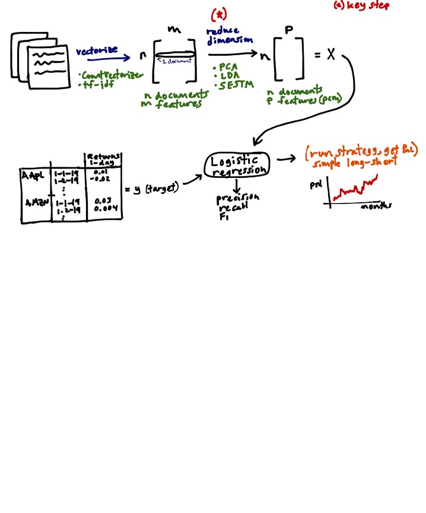

# NLP Strategy Overview
Predicting returns from 8K documents using text analysis and natural language processing.

## Data Preparation
1. Download 8K documents from today's S&P 500 companies for the past 5 years.
2. Extract the useful text from the html documents.
3. Clean text.
  1. remove proper nouns (Apple)
  2. make lower case (The -> the)
  3. expand contractions (can't -> cannot)
  4. remove special characters and digits ([^a-zA-z0-9\s])
  5. remove stopwords (a, the)
  6. remove html tags (

)
  7. remove accented characters
  8. remove newlines ([\r|\n|\r\n]+)
  9. remove extra whitespace
4. Tokenize text
  1. lemmatize
  2. stemmer
5. Vectorize to a document-term matrix using `CountVectorizer`.
  1. All our models require creating the document-term matrix. However, we 
  might later try models that use another vectorizer (e.g. tf-idf).
  
## Modeling
The key step in our strategy is to turn the document-term matrix into a
lower-dimensional representation.
We will try a few different 
1. 

## Implement from paper
I replicated the paper. Need data to estimate on. Also, need a strategy to use this sentiment factor.

## LDA for Topic Modeling
Latent Dirichlet Allocation (LDA) aims to model documents as arising from multiple topics, where a _topic_ is defined to be a distribution over a fixed vocabulary of terms. Each document exhibits these topics with different proportions. The K topics and their relative weights are treated as hidden variables. Given a collection of documents, the _posterior distribution_ of the hidden variables given the observed documents determines a hidden topical decomposition of the collection. 

### Resources
* [TOPIC MODELS](http://citeseerx.ist.psu.edu/viewdoc/download?doi=10.1.1.186.4283&rep=rep1&type=pdf)
* [Hierarchical Dirichlet Processes](https://www.stat.berkeley.edu/~aldous/206-Exch/Papers/hierarchical_dirichlet.pdf)